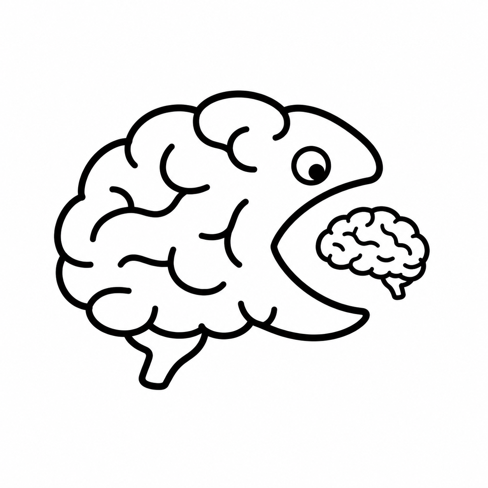
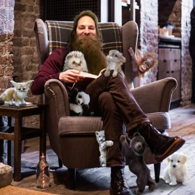

{: .site-logo }

The bitter lesson for cognitive science
{: .hero-eyebrow }

“You can’t play 20 questions with Nature and win.”

— Allen Newell
{: .hero-quote }

So let's stop asking one question at a time.
{: .hero-lead }

Scaling cognitive science through richer data and automated discovery.
{: .hero-tagline }

## Psyche

## AutoCog

Coming soon...

## Stay in the loop

Follow us for the latest updates on our research.
{: .social-lead }

{: .profile-photo }

**Younes Strittmatter**

[X](https://x.com/strittmatteryo){: .social-pill } [Bluesky](https://bsky.app/profile/younesstrittmatter.bsky.social){: .social-pill }

{: .profile-photo }

**Akshay Jagadish**

[X](https://x.com/akjagadish){: .social-pill } [Bluesky](https://bsky.app/profile/akjagadish.bsky.social){: .social-pill }

